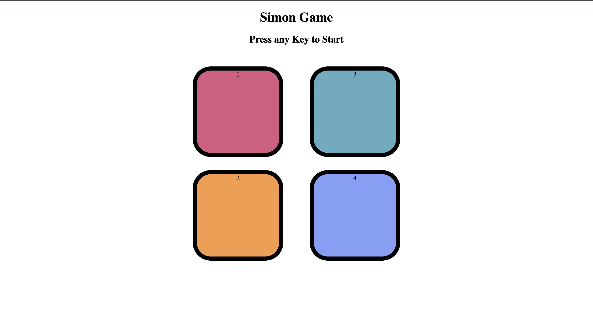

# Simon Says Game

Simon Says is a simple memory-based game built using HTML, CSS, and JavaScript. The game challenges the player to repeat an ever-growing sequence of button presses in the correct order.

## Table of Contents

- Screenshots
- Features
- How to Play
- Installation
- Technologies Used
- Project Structure
- Future Improvements
- Author

## Screenshots

Example:

## Features

- Press any key to start the game
- Buttons flash to indicate the sequence
- Level-based progression
- Game over screen when the wrong sequence is entered
- Clean UI with color-coded buttons

## How to Play

1. Press any key to start the game
2. Watch the sequence of color flashes shown by the game
3. Repeat the exact sequence by clicking the color buttons
4. Each correct attempt increases the level and adds one more color to the sequence
5. If you press the wrong button, the game ends and your score is shown

## Installation

1. Clone this repository

   git clone https://github.com/yourusername/simon-says-game.git

2. Navigate to the project folder

   cd simon-says-game

3. Open the index.html file in any web browser

   You can just double-click it or right-click and choose "Open With" your browser.

No additional setup or installation required.

## Technologies Used

- HTML
- CSS
- JavaScript

## Project Structure

- index.html - Main HTML structure
- style.css - All game styling
- app.js - Contains the game logic

## Future Improvements

- Add sound effects for button presses
- Store high scores using local storage
- Add animations or transitions
- Make the game fully mobile responsive

## Author

Your Name  
GitHub: https://github.com/MayurKotwal
